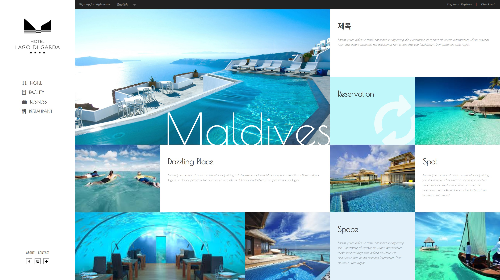

# 🖥️ Responsive Web Design (HTML & CSS)

다양한 화면 크기에 최적화된 반응형 웹사이트 예제입니다.  
HTML과 CSS만으로 구현되었으며, 모바일부터 데스크탑까지 자연스럽게 확장됩니다.

---

## 📸 데스크탑 미리보기



## 📸 모바일 미리보기


---

## 🔥 주요 기능

- 미디어 쿼리를 활용한 반응형 레이아웃
- 모바일/태블릿/PC 환경 대응
- HTML5, CSS3 표준 기반
- 직관적인 2단 구조와 유연한 그리드 시스템
- 스타일 유지보수를 고려한 폴더 구조

---

## ⚙️ 실행 방법

```bash
index.html 파일을 브라우저에서 직접 실행하면 됩니다.
```

> 별도의 빌드 도구나 서버가 필요하지 않습니다.

---

## 🛠 기술 스택

- HTML5
- CSS3 (미디어 쿼리 포함)
- Google Fonts

---

## 📁 프로젝트 구조

```
responsive-web/
├── index.html
├── css/
│   └── style.css
├── images/
│   └── (프로젝트에 사용된 이미지들)
└── README.md
```

---

## 👤 개발자

- GitHub: [[your-github-id](https://github.com/noooopa)]
